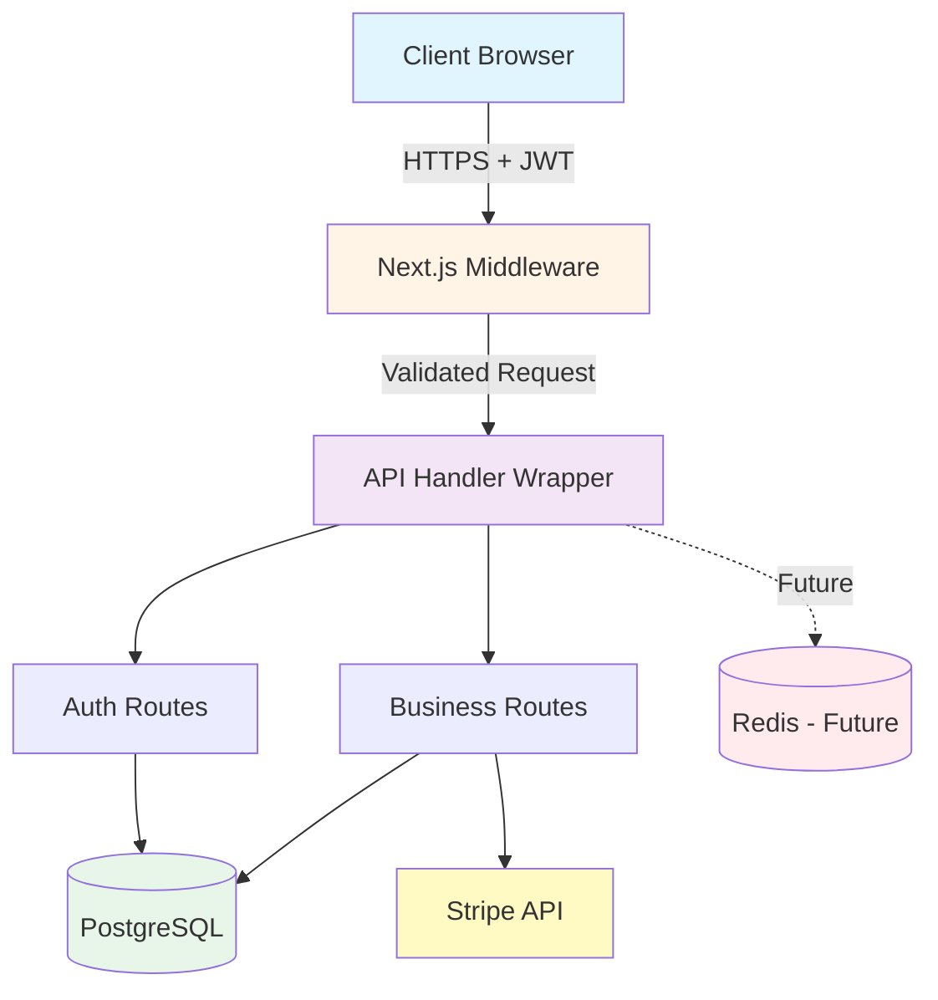
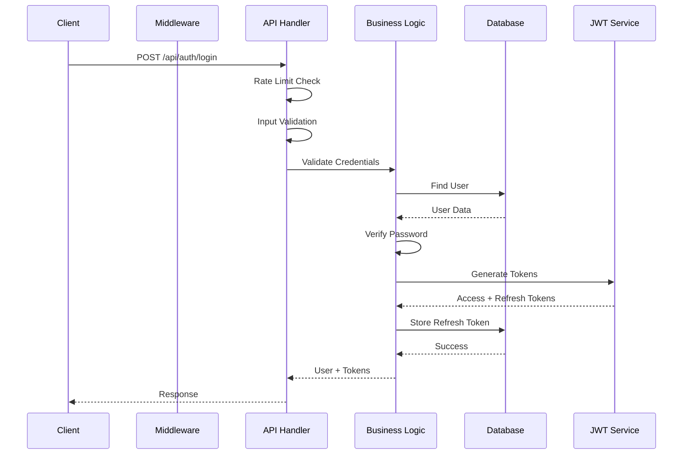

# System Architecture Diagram Description

This document provides detailed architecture descriptions for generating system diagrams. Use these descriptions with diagramming tools like Mermaid, PlantUML, or draw.io.

---

## 1. High-Level System Architecture

### Component Overview

```
┌─────────────────────────────────────────────────────────────────┐
│                         CLIENT LAYER                            │
│  ┌──────────────┐   ┌──────────────┐   ┌──────────────┐         │
│  │   Browser    │   │  Mobile App  │   │  API Client  │         │
│  │  (React)     │   │  (Future)    │   │  (Future)    │         │
│  └──────┬───────┘   └──────┬───────┘   └──────┬───────┘         │
│         │                  │                  │                 │
│         └──────────────────┼──────────────────┘                 │
│                            │                                    │
│                    HTTPS + JWT Bearer Tokens                    │
└────────────────────────────┼────────────────────────────────────┘
                             │
┌────────────────────────────▼─────────────────────────────────────┐
│                    NEXT.JS APPLICATION LAYER                     │
│  ┌─────────────────────────────────────────────────────────────┐ │
│  │              EDGE MIDDLEWARE (middleware.ts)                │ │
│  │  • JWT Token Validation (stateless)                         │ │
│  │  • RBAC Enforcement (role checks)                           │ │
│  │  • Request Context Injection (x-user-id, x-user-role)       │ │
│  └─────────────────────────────────────────────────────────────┘ │
│                              │                                   │
│  ┌───────────────────────────▼─────────────────────────────────┐ │
│  │              API ROUTE HANDLER (createApiHandler)           │ │
│  │  • Rate Limiting (per-route config)                         │ │
│  │  • Input Validation (Zod schemas)                           │ │
│  │  • Error Handling (custom error classes)                    │ │
│  │  • Request Logging (structured, with duration)              │ │
│  └───────────────────────────┬─────────────────────────────────┘ │
│                              │                                   │
│  ┌───────────────────────────▼─────────────────────────────────┐ │
│  │                    BUSINESS LOGIC LAYER                     │ │
│  │  • Authentication Logic (lib/auth.ts)                       │ │
│  │  • RBAC Logic (lib/rbac.ts)                                 │ │
│  │  • Feature Flags (lib/feature-flags.ts)                     │ │
│  │  • Stripe Integration (lib/stripe.ts)                       │ │
│  └─────────────────────────────┬───────────────────────────────┘ │
└────────────────────────────────┼─────────────────────────────────┘
                                 │
        ┌────────────────────────┼──────────────────────┐
        │                        │                      │
┌───────▼────────┐    ┌──────────▼──────────┐   ┌───────▼──────┐
│  PostgreSQL    │    │   Stripe API        │   │   Redis      │
│   Database     │    │   (External)        │   │  (Future)    │
│                │    │                     │   │              │
│ • Users        │    │ • Checkout          │   │ • Rate Limit │
│ • Tokens       │    │ • Subscriptions     │   │ • Caching    │
│ • Subscriptions│    │ • Webhooks          │   │              │
│ • Feature Flags│    │                     │   │              │
└────────────────┘    └─────────────────────┘   └──────────────┘
```

---

## 2. Detailed Component Diagram

### Application Components

```
┌──────────────────────────────────────────────────────────────────┐
│                      NEXT.JS APP ROUTER                          │
├──────────────────────────────────────────────────────────────────┤
│                                                                  │
│  ┌──────────────────────────────────────────────────────────┐    │
│  │                    MIDDLEWARE LAYER                      │    │
│  │  File: middleware.ts                                     │    │
│  │  • JWT Verification (lib/jwt.ts)                         │    │
│  │  • User Lookup (Prisma)                                  │    │
│  │  • Role Validation (lib/rbac.ts)                         │    │
│  │  • Context Injection                                     │    │
│  └──────────────────────────────────────────────────────────┘    │
│                              │                                   │
│  ┌───────────────────────────▼────────────────────────────────┐  │
│  │                  API ROUTE LAYER                           │  │
│  │                                                            │  │
│  │  ┌────────────────────────────────────────────────────┐    │  │
│  │  │  API Handler Wrapper (lib/api-handler.ts)          │    │  │
│  │  │  • Rate Limiting                                   │    │  │
│  │  │  • Authentication Check                            │    │  │
│  │  │  • Error Handling                                  │    │  │
│  │  │  • Request Logging                                 │    │  │
│  │  └────────────────────────────────────────────────────┘    │  │
│  │                            │                               │  │
│  │  ┌─────────────────────────▼──────────────────────────┐    │  │
│  │  │              API ENDPOINTS                         │    │  │
│  │  │                                                    │    │  │
│  │  │  /api/auth/*                                       │    │  │
│  │  │    • POST /register                                │    │  │
│  │  │    • POST /login                                   │    │  │
│  │  │    • POST /refresh                                 │    │  │
│  │  │    • POST /logout                                  │    │  │
│  │  │                                                    │    │  │
│  │  │  /api/stripe/*                                     │    │  │
│  │  │    • POST /checkout                                │    │  │
│  │  │    • POST /portal                                  │    │  │
│  │  │    • POST /webhook                                 │    │  │
│  │  │                                                    │    │  │
│  │  │  /api/subscription                                 │    │  │
│  │  │    • GET /                                         │    │  │
│  │  │                                                    │    │  │
│  │  │  /api/feature-flags                                │    │  │
│  │  │    • GET /                                         │    │  │
│  │  │    • POST /                                        │    │  │
│  │  │                                                    │    │  │
│  │  │  /api/users/*                                      │    │  │
│  │  │    • GET /                                         │    │  │
│  │  │    • GET /[id]                                     │    │  │
│  │  │    • PATCH /[id]                                   │    │  │
│  │  │                                                    │    │  │
│  │  │  /api/admin/*                                      │    │  │
│  │  │    • GET /stats                                    │    │  │
│  │  └────────────────────────────────────────────────────┘    │  │
│  └────────────────────────────────────────────────────────────┘  │
│                                                                  │
│  ┌──────────────────────────────────────────────────────────┐    │
│  │              UTILITY LIBRARIES (lib/)                    │    │
│  │  • auth.ts - Server-side auth utilities                  │    │
│  │  • auth-client.ts - Client-side auth utilities           │    │
│  │  • jwt.ts - JWT token generation/verification            │    │
│  │  • rbac.ts - Role-based access control                   │    │
│  │  • stripe.ts - Stripe integration                        │    │
│  │  • feature-flags.ts - Feature flag system                │    │
│  │  • rate-limit.ts - Rate limiting                         │    │
│  │  • validation.ts - Zod validation schemas                │    │
│  │  • errors.ts - Custom error classes                      │    │
│  │  • logger.ts - Structured logging                        │    │
│  │  • prisma.ts - Database client                           │    │
│  └──────────────────────────────────────────────────────────┘    │
└──────────────────────────────────────────────────────────────────┘
```

---

## 3. Authentication Flow Diagram

### Registration Flow

```
┌─────────┐
│ Client  │
└────┬────┘
     │
     │ POST /api/auth/register
     │ { name, email, password }
     ▼
┌─────────────────────────────────────┐
│  createApiHandler                   │
│  • Rate Limit Check (5/hour)        │
└────────────┬────────────────────────┘
             │
             ▼
┌─────────────────────────────────────┐
│  Input Validation (Zod)             │
│  • nameSchema                       │
│  • emailSchema                      │
│  • passwordSchema                   │
└────────────┬────────────────────────┘
             │
             ▼
┌─────────────────────────────────────┐
│  Business Logic                     │
│  • Check email uniqueness (DB)      │
│  • Hash password (bcrypt)           │
│  • Create user (Prisma)             │
└────────────┬────────────────────────┘
             │
             ▼
┌─────────────────────────────────────┐
│  Token Generation                   │
│  • Access Token (15min, JWT_SECRET) │
│  • Refresh Token (7d, JWT_REFRESH)  │
└────────────┬────────────────────────┘
             │
             ▼
┌─────────────────────────────────────┐
│  Store Refresh Token (DB)           │
│  • refresh_tokens table             │
└────────────┬────────────────────────┘
             │
             ▼
┌─────────┐
│ Client  │ ← { user, accessToken, refreshToken }
└─────────┘
```

### Login Flow

```
┌─────────┐
│ Client  │
└────┬────┘
     │
     │ POST /api/auth/login
     │ { email, password }
     ▼
┌─────────────────────────────────────┐
│  createApiHandler                   │
│  • Rate Limit Check (10/15min)      │
└────────────┬────────────────────────┘
             │
             ▼
┌─────────────────────────────────────┐
│  Input Validation (Zod)             │
└────────────┬────────────────────────┘
             │
             ▼
┌─────────────────────────────────────┐
│  Find User (Prisma)                 │
│  • WHERE email = ?                  │
└────────────┬────────────────────────┘
             │
             ▼
┌─────────────────────────────────────┐
│  Verify Password (bcrypt.compare)   │
└────────────┬────────────────────────┘
             │
             ▼
┌─────────────────────────────────────┐
│  Generate Tokens                    │
│  • Access Token                     │
│  • Refresh Token                    │
└────────────┬────────────────────────┘
             │
             ▼
┌─────────────────────────────────────┐
│  Store Refresh Token (DB)           │
└────────────┬────────────────────────┘
             │
             ▼
┌─────────┐
│ Client  │ ← { user, accessToken, refreshToken }
└─────────┘
```

### Token Refresh Flow (Critical Security)

```
┌─────────┐
│ Client  │
└────┬────┘
     │
     │ POST /api/auth/refresh
     │ { refreshToken }
     ▼
┌─────────────────────────────────────┐
│  Input Validation                   │
└────────────┬────────────────────────┘
             │
             ▼
┌─────────────────────────────────────┐
│  Verify JWT (JWT_REFRESH_SECRET)    │
└────────────┬────────────────────────┘
             │
             ▼
┌─────────────────────────────────────┐
│  Verify Token in DB                 │
│  • Check exists                     │
│  • Check not expired                │
└────────────┬────────────────────────┘
             │
             ▼
┌─────────────────────────────────────┐
│  TOKEN ROTATION (Security)          │
│  1. Delete old refresh token        │
│  2. Generate new access token       │
│  3. Generate new refresh token      │
│  4. Store new refresh token         │
└────────────┬────────────────────────┘
             │
             ▼
┌─────────┐
│ Client  │ ← { accessToken, refreshToken }
└─────────┘
```

### Protected Request Flow

```
┌─────────┐
│ Client  │
└────┬────┘
     │
     │ GET /api/users
     │ Authorization: Bearer <accessToken>
     ▼
┌─────────────────────────────────────┐
│  Middleware (middleware.ts)         │
│  • Extract token from header        │
│  • Verify JWT signature             │
│  • Check expiration                 │
│  • Lookup user in DB                │
│  • Check role                       │
└────────────┬────────────────────────┘
             │
             │ Inject: x-user-id, x-user-role
             ▼
┌─────────────────────────────────────┐
│  createApiHandler                   │
│  • Rate Limit Check                 │
│  • Extract auth context             │
└────────────┬────────────────────────┘
             │
             ▼
┌─────────────────────────────────────┐
│  Business Logic                     │
│  • requireAdmin(auth)               │
│  • Query users (Prisma)             │
└────────────┬────────────────────────┘
             │
             ▼
┌─────────┐
│ Client  │ ← { users: [...], pagination }
└─────────┘
```

---

## 4. Database Schema Diagram

### Entity Relationship Diagram

```
┌────────────────────────────────────────────────────────────────┐
│                        USER                                    │
│  ┌──────────────────────────────────────────────────────┐      │
│  │ id: String (PK, cuid)                                │      │
│  │ email: String (unique)                               │      │
│  │ password: String (bcrypt hashed)                     │      │
│  │ name: String?                                        │      │
│  │ role: UserRole (USER | ADMIN)                        │      │
│  │ emailVerified: DateTime?                             │      │
│  │ createdAt: DateTime                                  │      │
│  │ updatedAt: DateTime                                  │      │
│  └──────────────────────────────────────────────────────┘      │
│                            │                                   │
│          ┌───────────────────┼───────────────────┐             │
│          │                   │                   │             │
│          │ 1                 │ 1                 │ 1           │
│          │                   │                   │             │
│          │ *                 │ 1                 │ *           │
│          │                   │                   │             │
│  ┌────────▼───────┐  ┌────────▼────────┐  ┌───────▼──────────┐ │
│  │ REFRESH_TOKEN  │  │  SUBSCRIPTION   │  │ USER_FEATURE_FLAG│ │
│  │                │  │                 │  │                  │ │
│  │ id: String     │  │ id: String      │  │ id: String       │ │
│  │ token: String  │  │ userId: String  │  │ userId: String   │ │
│  │ userId: String │  │ stripeCustomerId│  │ flagKey: String  │ │
│  │ expiresAt: DT  │  │ stripeSubId: ?  │  │ enabled: Boolean │ │
│  │ createdAt: DT  │  │ status: Enum    │  │ createdAt: DT    │ │
│  │                │  │ periodStart: ?  │  │ updatedAt: DT    │ │
│  │ @@index(userId)│  │ periodEnd: ?    │  │ @@unique(userId, │ │
│  │ @@index(token) │  │ cancelAtEnd:Bool│  │          flagKey)│ │
│  └────────────────┘  └─────────────────┘  └──────────────────┘ │
│                                                                │
│  ┌───────────────────────────────────────────────────────────┐ │
│  │                    ENUMS                                  │ │
│  │  UserRole: USER | ADMIN                                   │ │
│  │  SubscriptionStatus: ACTIVE | CANCELED | PAST_DUE |       │ │
│  │                  TRIALING | INCOMPLETE                    │ │
│  └───────────────────────────────────────────────────────────┘ │
└────────────────────────────────────────────────────────────────┘

```

### Database Indexes

```
Users Table:
  • PRIMARY KEY: id
  • UNIQUE: email
  • INDEX: (none - simple table)

RefreshTokens Table:
  • PRIMARY KEY: id
  • UNIQUE: token
  • INDEX: userId (for fast user lookup)
  • INDEX: token (for fast token lookup)

Subscriptions Table:
  • PRIMARY KEY: id
  • UNIQUE: userId
  • UNIQUE: stripeCustomerId
  • UNIQUE: stripeSubscriptionId
  • INDEX: stripeCustomerId
  • INDEX: stripeSubscriptionId

UserFeatureFlags Table:
  • PRIMARY KEY: id
  • UNIQUE: (userId, flagKey)
  • INDEX: userId
```

---

## 5. Stripe Integration Flow

### Checkout Flow

```
┌─────────┐
│ Client  │
└────┬────┘
     │
     │ POST /api/stripe/checkout
     │ { planType: "monthly" | "yearly" }
     │ Authorization: Bearer <token>
     ▼
┌─────────────────────────────────────┐
│  Middleware: Auth Check             │
└────────────┬────────────────────────┘
             │
             ▼
┌─────────────────────────────────────┐
│  Business Logic                     │
│  • Get or create Stripe customer    │
│  • Create checkout session          │
└────────────┬────────────────────────┘
             │
             │ API Call
             ▼
┌─────────────────────────────────────┐
│         Stripe API                  │
│  • Create checkout session          │
│  • Return session URL               │
└────────────┬────────────────────────┘
             │
             ▼
        ┌─────────┐
        │ Client  │ ← { url: "https://checkout.stripe.com/..." }
        │         │ → Redirect to Stripe Checkout
        └─────────┘
```

### Webhook Flow

```
┌─────────────────┐
│   Stripe        │
└────────┬────────┘
         │
         │ POST /api/stripe/webhook
         │ Stripe-Signature: <signature>
         │ { event data }
         ▼
┌─────────────────────────────────────┐
│  Webhook Handler                    │
│  • Verify signature                 │
│  • Parse event                      │
└────────────┬────────────────────────┘
             │
             ▼
┌─────────────────────────────────────┐
│  Event Processing                   │
│  • customer.subscription.created    │
│  • customer.subscription.updated    │
│  • customer.subscription.deleted    │
└────────────┬────────────────────────┘
             │
             ▼
┌─────────────────────────────────────┐
│  Sync to Database                   │
│  • Update subscription status       │
│  • Update period dates              │
│  • Handle cancellation              │
└────────────┬────────────────────────┘
             │
             ▼
┌─────────────────────────────────────┐
│  Response                           │
│  { received: true }                 │
└─────────────────────────────────────┘
```

---

## 6. Security Layers Diagram

### Defense-in-Depth Architecture

```
┌─────────────────────────────────────────────────────────────┐
│                    LAYER 1: INPUT VALIDATION                │
│  • Zod schemas on all endpoints                             │
│  • Type-safe validation                                     │
│  • Password strength requirements                           │
└─────────────────────────────────────────────────────────────┘
                            │
┌───────────────────────────▼─────────────────────────────────┐
│                    LAYER 2: AUTHENTICATION                  │
│  • JWT token verification                                   │
│  • Separate secrets for access/refresh                      │
│  • Short-lived access tokens (15min)                        │
│  • Refresh token rotation                                   │
└───────────────────────────┬─────────────────────────────────┘
                            │
┌───────────────────────────▼─────────────────────────────────┐
│                    LAYER 3: AUTHORIZATION                   │
│  • Role-based access control (RBAC)                         │
│  • Middleware enforcement                                   │
│  • Per-route role requirements                              │
└───────────────────────────┬─────────────────────────────────┘
                            │
┌───────────────────────────▼─────────────────────────────────┐
│                    LAYER 4: RATE LIMITING                   │
│  • Per-route configurable limits                            │
│  • IP-based (extensible to user-based)                      │
│  • Prevents brute force attacks                             │
└───────────────────────────┬─────────────────────────────────┘
                            │
┌───────────────────────────▼─────────────────────────────────┐
│                    LAYER 5: ERROR HANDLING                  │
│  • Custom error classes                                     │
│  • No information leakage                                   │
│  • Structured logging                                       │
└─────────────────────────────────────────────────────────────┘
```

---

## 7. Request Flow Sequence Diagram

### Complete Request Lifecycle

```
Client          Middleware        API Handler      Business Logic    Database      Stripe
  │                 │                  │                 │              │            │
  │──POST /api/users──────────────────>│                 │              │            │
  │                 │                  │                 │              │            │
  │                 │──Verify JWT─────>│                 │              │            │
  │                 │                  │                 │              │            │
  │                 │<─User Context────│                 │              │            │
  │                 │                  │                 │              │            │
  │                 │                  │──Rate Limit────>│              │            │
  │                 │                  │                 │              │            │
  │                 │                  │──Auth Check────>│              │            │
  │                 │                  │                 │              │            │
  │                 │                  │──Validate──────>│              │            │
  │                 │                  │                 │              │            │
  │                 │                  │──requireAdmin──>│              │            │
  │                 │                  │                 │              │            │
  │                 │                  │                 │──Query──────>│            │
  │                 │                  │                 │              │            │
  │                 │                  │                 │<─Users───────│            │
  │                 │                  │                 │              │            │
  │                 │                  │<─Response───────│              │            │
  │                 │                  │                 │              │            │
  │                 │                  │──Log Request───>│              │            │
  │                 │                  │                 │              │            │
  │<─200 OK─────────│<─────────────────│<────────────────│              │            │
  │                 │                  │                 │              │            │
```

---

## 8. Data Flow Diagram

### User Registration Data Flow

```
┌─────────┐
│ Client  │
│         │ 1. POST /api/auth/register
│         │    { name, email, password }
└────┬────┘
     │
     ▼
┌─────────────────┐
│ Rate Limiter    │ 2. Check rate limit (5/hour)
│ (In-Memory)     │
└────┬────────────┘
     │
     ▼
┌─────────────────┐
│ Zod Validator   │ 3. Validate input
│                 │    • nameSchema
│                 │    • emailSchema
│                 │    • passwordSchema
└────┬────────────┘
     │
     ▼
┌─────────────────┐
│ Prisma Client   │ 4. Check email uniqueness
│                 │    SELECT * FROM users WHERE email = ?
└────┬────────────┘
     │
     ▼
┌─────────────────┐
│ bcrypt          │ 5. Hash password
│                 │    hash(password, 10)
└────┬────────────┘
     │
     ▼
┌─────────────────┐
│ Prisma Client   │ 6. Create user
│                 │    INSERT INTO users ...
└────┬────────────┘
     │
     ▼
┌─────────────────┐
│ JWT Generator   │ 7. Generate tokens
│                 │    • Access Token (15min)
│                 │    • Refresh Token (7 days)
└────┬────────────┘
     │
     ▼
┌─────────────────┐
│ Prisma Client   │ 8. Store refresh token
│                 │    INSERT INTO refresh_tokens ...
└────┬────────────┘
     │
     ▼
┌─────────┐
│ Client  │ 9. Return { user, accessToken, refreshToken }
└─────────┘
```

---

## 9. Scalability Architecture

### Current State (0-10K Users)

```
┌─────────────────────────────────────────┐
│         Single Next.js Instance         │
│  ┌───────────────────────────────────┐  │
│  │  App Router + API Routes          │  │
│  │  • In-memory rate limiting        │  │
│  │  • Console logging                │  │
│  └───────────────────────────────────┘  │
└──────────────────┬──────────────────────┘
                   │
         ┌─────────┴─────────┐
         │                     │
┌────────▼────────┐  ┌────────▼────────┐
│   PostgreSQL    │  │    Stripe       │
│   (Primary)     │  │     API         │
└─────────────────┘  └─────────────────┘
```

### Future State (100K+ Users)

```
┌─────────────────────────────────────────────────────────┐
│              Load Balancer                              │
└──────────────────┬──────────────────────────────────────┘
                   │
    ┌──────────────┼──────────────┐
    │              │              │
┌───▼───┐    ┌────▼────┐    ┌────▼────┐
│Next.js│    │ Next.js │    │ Next.js │
│App #1 │    │ App #2  │    │ App #3  │
└───┬───┘    └────┬────┘    └────┬────┘
    │              │              │
    └──────────────┼──────────────┘
                   │
    ┌──────────────┼──────────────┐
    │              │              │
┌───▼───┐    ┌────▼─────┐   ┌────▼─────┐
│Redis  │    │PostgreSQL│   │PostgreSQL│
│Cache  │    │ Primary  │   │ Replica  │
└───────┘    └────┬─────┘   └────┬─────┘
                  │              │
                  └──────┬───────┘
                         │
                  ┌──────▼──────┐
                  │   Stripe    │
                  │     API     │
                  └─────────────┘
```

---

## 10. Mermaid Diagram Code

### System Architecture (Mermaid)



### Authentication Flow (Mermaid)



### Database Schema (Mermaid ERD)

```mermaid
erDiagram
    USER ||--o{ REFRESH_TOKEN : has
    USER ||--o| SUBSCRIPTION : has
    USER ||--o{ USER_FEATURE_FLAG : has
    
    USER {
        string id PK
        string email UK
        string password
        string name
        enum role
        datetime createdAt
        datetime updatedAt
    }
    
    REFRESH_TOKEN {
        string id PK
        string token UK
        string userId FK
        datetime expiresAt
        datetime createdAt
    }
    
    SUBSCRIPTION {
        string id PK
        string userId FK UK
        string stripeCustomerId UK
        string stripeSubscriptionId UK
        enum status
        datetime currentPeriodStart
        datetime currentPeriodEnd
        boolean cancelAtPeriodEnd
    }
    
    USER_FEATURE_FLAG {
        string id PK
        string userId FK
        string flagKey
        boolean enabled
        datetime createdAt
        datetime updatedAt
    }
```

---

## 11. Component Interaction Matrix

| Component | Interacts With | Purpose |
|-----------|---------------|---------|
| **Middleware** | JWT Service, Database | Token validation, user lookup |
| **API Handler** | Rate Limiter, Validator, Logger | Cross-cutting concerns |
| **Auth Routes** | Database, JWT Service, bcrypt | Authentication operations |
| **Stripe Routes** | Stripe API, Database | Subscription management |
| **Feature Flags** | Database | Per-user feature control |
| **RBAC** | Auth Context | Role enforcement |
| **Logger** | All Components | Structured logging |
| **Validator** | All Routes | Input validation |

---

## 12. Technology Stack Diagram

```
┌─────────────────────────────────────────────────────────┐
│                    FRONTEND LAYER                       │
│  • Next.js 14 App Router                                │
│  • React 18                                             │
│  • TypeScript                                           │
│  • Tailwind CSS                                         │
└─────────────────────────────────────────────────────────┘
                            │
┌───────────────────────────▼─────────────────────────────┐
│                    APPLICATION LAYER                    │
│  • Next.js API Routes                                   │
│  • Edge Middleware                                      │
│  • Server Components                                    │
└───────────────────────────┬─────────────────────────────┘
                            │
┌───────────────────────────▼─────────────────────────────┐
│                    BUSINESS LOGIC                       │
│  • Custom JWT Auth                                      │
│  • RBAC System                                          │
│  • Feature Flags                                        │
│  • Stripe Integration                                   │
└───────────────────────────┬─────────────────────────────┘
                            │
        ┌───────────────────┼───────────────────┐
        │                   │                   │
┌───────▼──────┐  ┌─────────▼────────┐  ┌──────▼──────┐
│  PostgreSQL  │  │   Stripe API     │  │   Redis     │
│  (Prisma ORM)│  │   (External)     │  │  (Future)   │
└──────────────┘  └──────────────────┘  └─────────────┘
```

---

## Usage Instructions

### For Mermaid Diagrams

Copy the Mermaid code blocks into:
- GitHub README (native support)
- Mermaid Live Editor: https://mermaid.live
- VS Code with Mermaid extension
- Notion, Confluence (with plugins)

### For PlantUML

Convert descriptions to PlantUML syntax using:
- PlantUML Online: http://www.plantuml.com/plantuml
- VS Code PlantUML extension

### For Draw.io / Diagrams.net

Use the component descriptions to manually create diagrams:
1. Open https://app.diagrams.net
2. Use the descriptions above as reference
3. Create layers for each diagram type

### For Architecture Documentation

These descriptions can be used in:
- Technical design documents
- System documentation
- Onboarding materials
- Architecture review presentations

---

## Key Architecture Principles

1. **Layered Defense**: Multiple security layers
2. **Separation of Concerns**: Clear boundaries between layers
3. **Stateless Design**: JWT tokens, no server-side sessions
4. **Type Safety**: TypeScript + Zod runtime validation
5. **Scalability**: Designed for horizontal scaling
6. **Observability**: Structured logging, request tracking
7. **Maintainability**: Documented tradeoffs, clean code

---

This architecture description provides comprehensive documentation for understanding, documenting, and presenting the system architecture.

