# System Architecture Diagrams (Mermaid)

This file contains Mermaid diagrams for the SaaS Starter project. These diagrams can be viewed directly on GitHub, in VS Code with the Mermaid extension, or on https://mermaid.live.

---

## 1. High-Level System Architecture

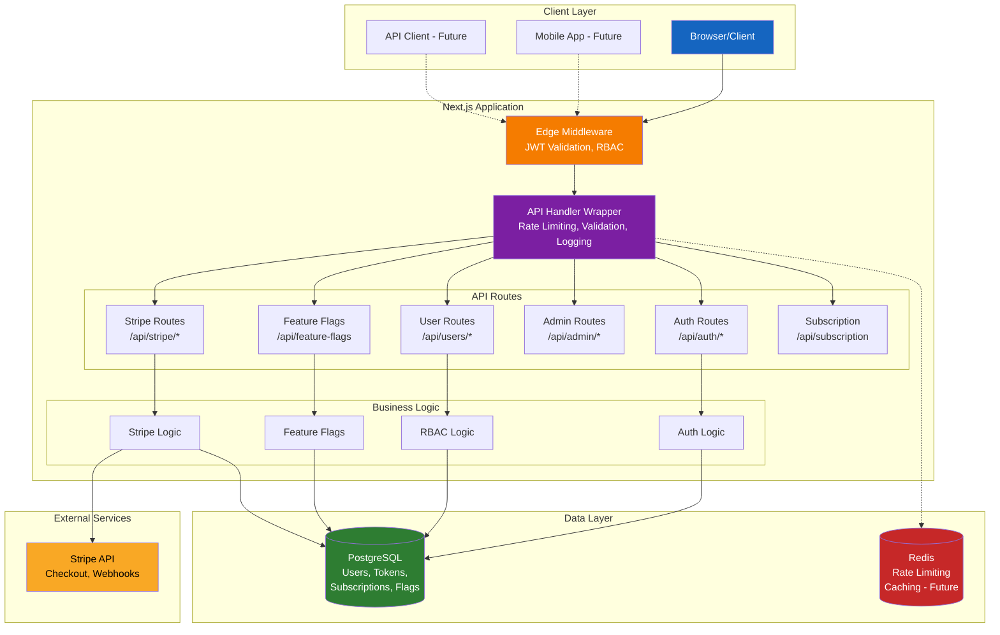

---

## 2. Authentication Flow Sequence Diagram

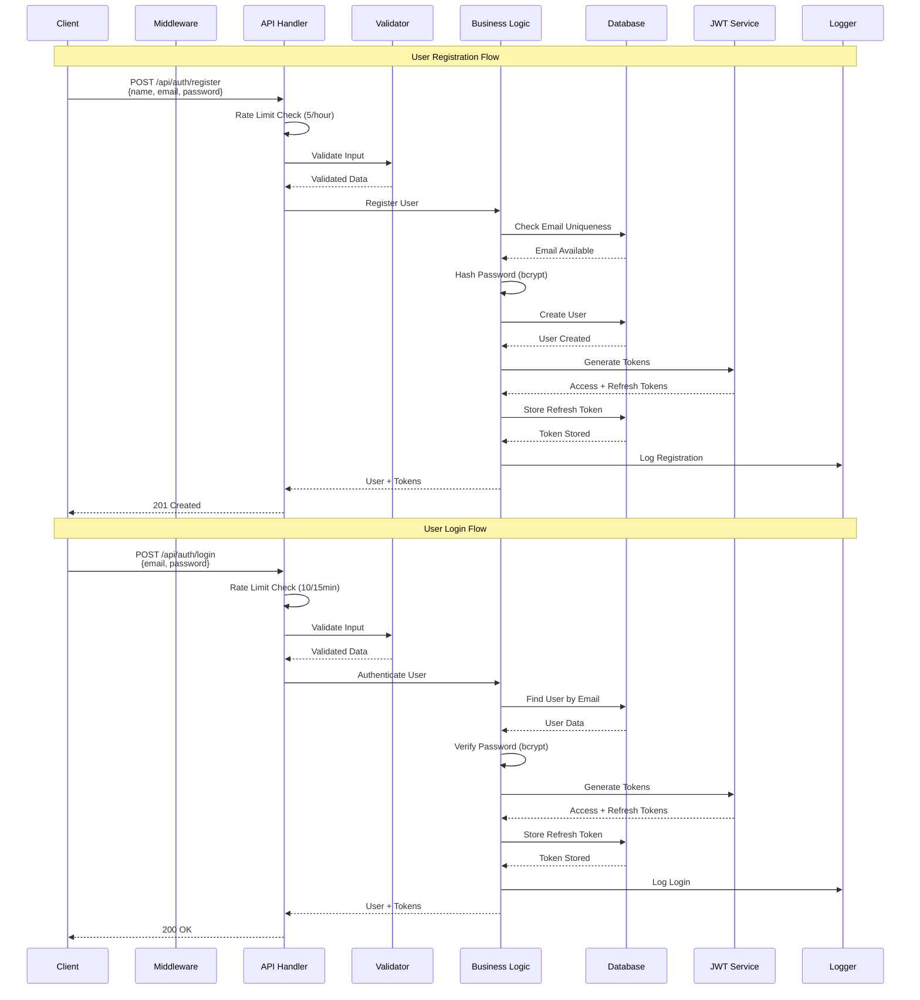

---

## 3. Token Refresh Flow (Security Critical)

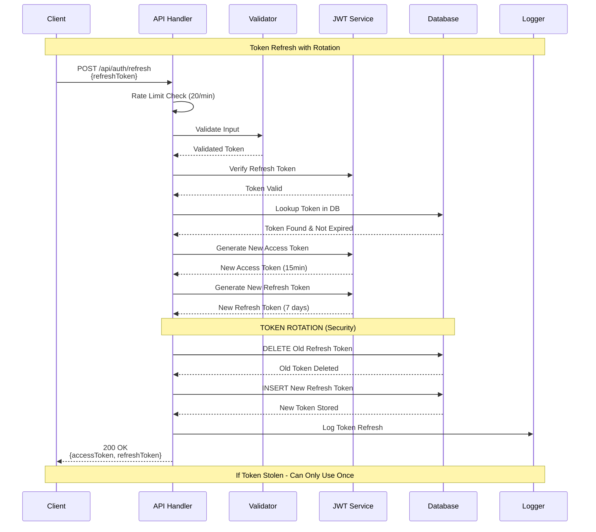

---

## 4. Protected Request Flow

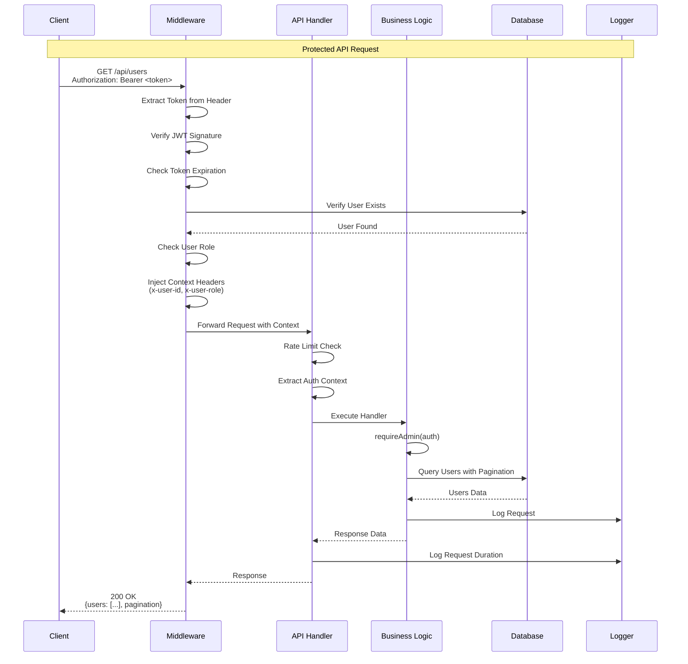

---

## 5. Database Entity Relationship Diagram

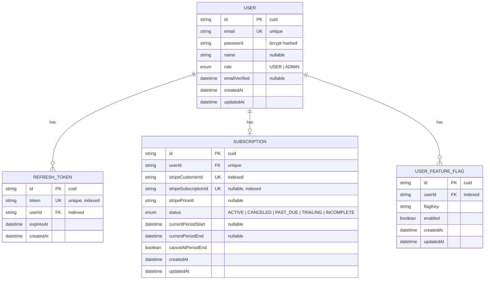

---

## 6. Stripe Integration Flow

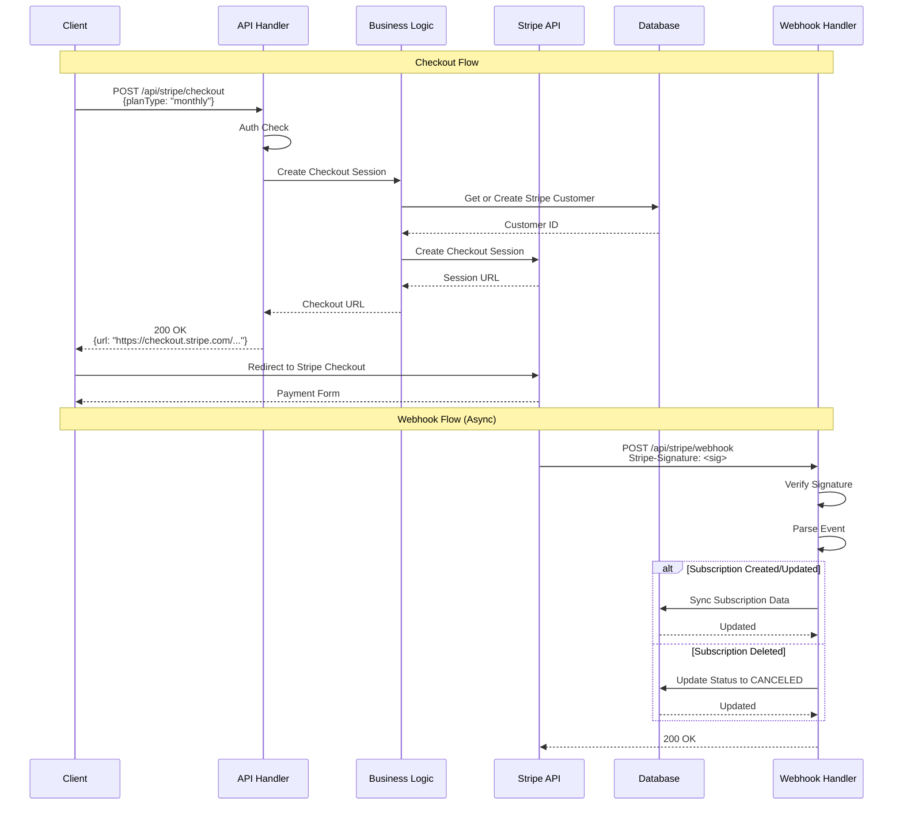

---

## 7. Security Layers Architecture

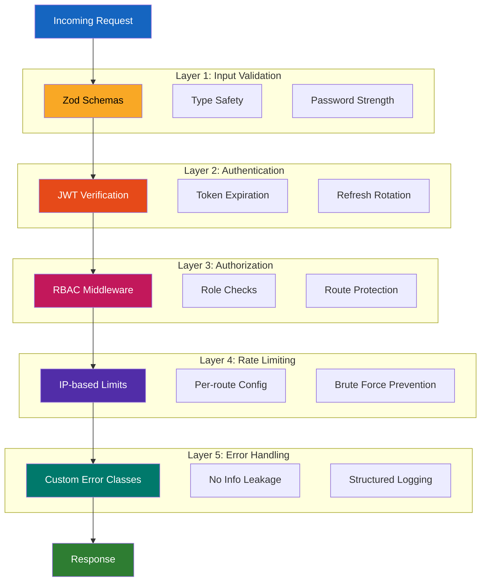

---

## 8. API Route Structure

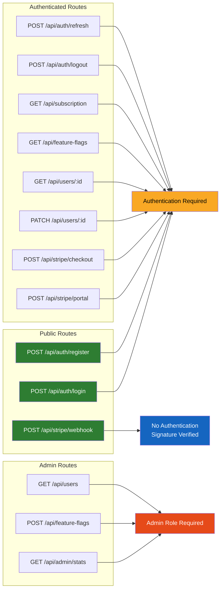

---

## 9. Scalability Evolution

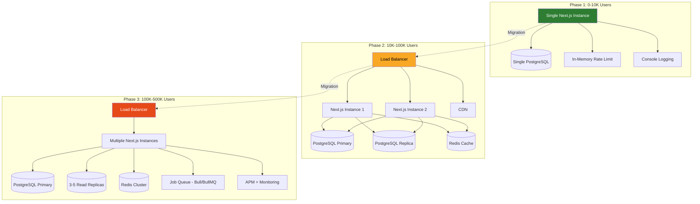

---

## 10. Request Processing Pipeline

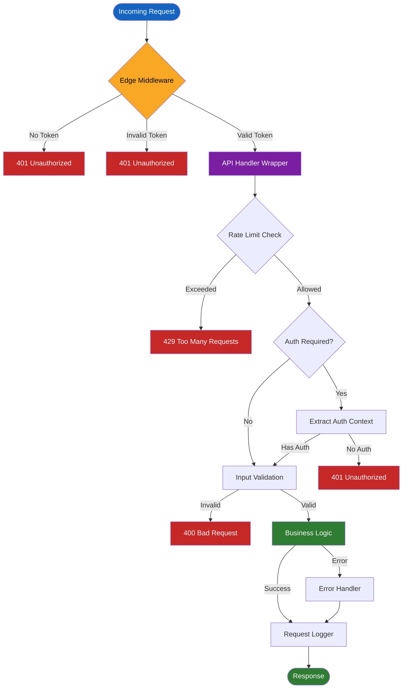

---

## 11. Component Dependency Graph

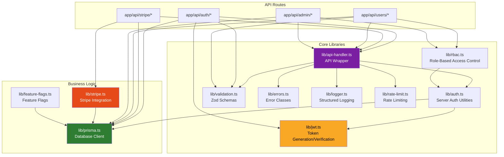

---

## 12. Data Flow: User Registration

```mermaid
flowchart LR
    Start([Client Request]) --> RL[Rate Limiter<br/>5/hour per IP]
    RL --> V[Zod Validator<br/>name, email, password]
    V --> DB1[(Database<br/>Check Email)]
    DB1 --> BC[bcrypt<br/>Hash Password]
    BC --> DB2[(Database<br/>Create User)]
    DB2 --> JWT[JWT Service<br/>Generate Tokens]
    JWT --> DB3[(Database<br/>Store Refresh Token)]
    DB3 --> LOG[Logger<br/>Log Event]
    LOG --> End([Response<br/>User + Tokens])
    
    style Start fill:#1565c0,color:#fff
    style End fill:#2e7d32,color:#fff
    style RL fill:#f9a825,color:#000
    style V fill:#7b1fa2,color:#fff
    style BC fill:#e64a19,color:#fff
    style JWT fill:#512da8,color:#fff
    style DB1 fill:#2e7d32,color:#fff
    style DB2 fill:#2e7d32,color:#fff
    style DB3 fill:#2e7d32,color:#fff
    style LOG fill:#00796b,color:#fff
```

---

## 13. Feature Flag System

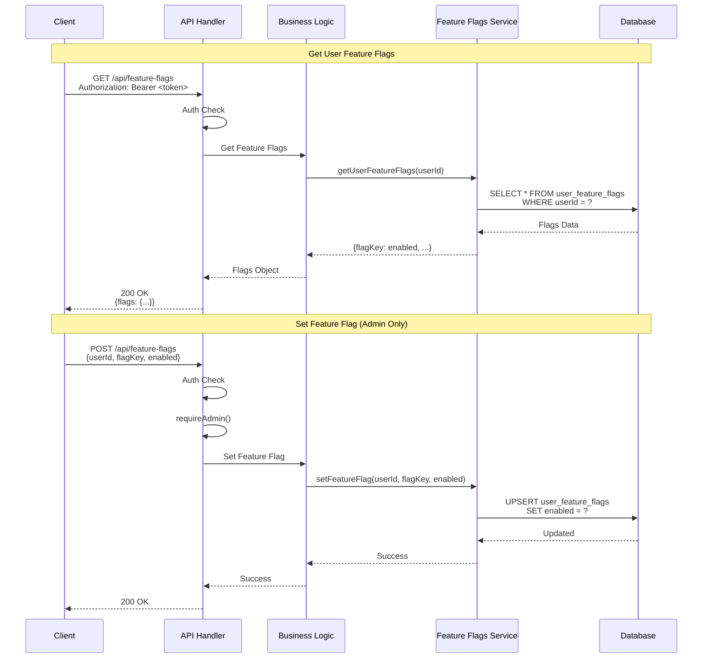

---

## 14. Error Handling Flow

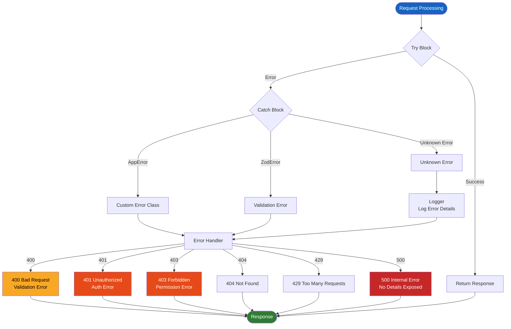

---

## 15. Complete System Overview

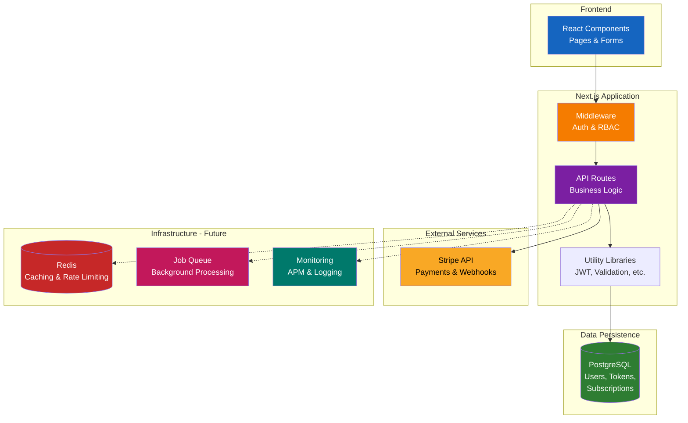

---

## Usage Instructions

### Viewing These Diagrams

1. **GitHub**: These diagrams render automatically in GitHub markdown files
2. **VS Code**: Install "Markdown Preview Mermaid Support" extension
3. **Online**: Copy code to https://mermaid.live
4. **Documentation**: Include in technical docs, presentations, or README

### Adding to README

Copy any diagram code block into your README.md file. GitHub will automatically render it.

### Exporting

- **PNG/SVG**: Use Mermaid Live Editor to export
- **PDF**: Use Mermaid CLI: `mmdc -i diagram.mmd -o diagram.pdf`

---

## Diagram Index

1. **High-Level System Architecture** - Overall system structure
2. **Authentication Flow** - Registration and login sequences
3. **Token Refresh Flow** - Security-critical token rotation
4. **Protected Request Flow** - How authenticated requests work
5. **Database ERD** - Entity relationships
6. **Stripe Integration** - Payment and webhook flows
7. **Security Layers** - Defense-in-depth architecture
8. **API Route Structure** - Route organization and protection
9. **Scalability Evolution** - Growth from 0 to 1M users
10. **Request Processing Pipeline** - Request flow with error handling
11. **Component Dependencies** - Library and component relationships
12. **Data Flow: Registration** - Step-by-step registration process
13. **Feature Flag System** - Feature flag management flow
14. **Error Handling Flow** - Error processing and responses
15. **Complete System Overview** - Full system with future infrastructure

---

All diagrams are production-ready and can be used in documentation, presentations, or architecture reviews.

